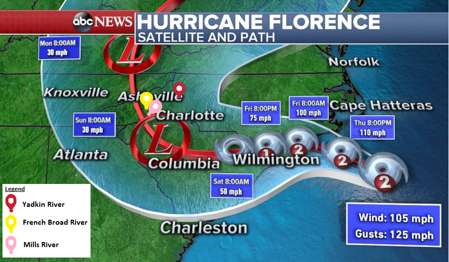

\newpage
\tableofcontents 
\newpage
\listoftables 
\newpage
\listoffigures 
\newpage


```{r setup, include=FALSE}
# Load packages
if(!require(pacman)) install.packages("pacman")
pacman::p_load(tidyverse, lubridate, ggpubr, dplyr, zoo, dataRetrieval, knitr, 
               kableExtra, cowplot)

# Set ggplot theme
mytheme <- theme_grey() +
  theme(axis.text = element_text(color = "black"), 
        legend.position = "right", 
        plot.title = element_text(hjust = 0.5))
theme_set(mytheme)
```


```{r DataRaw, include=FALSE}
# Select Site
siteNo2 <-"02111000"
siteNo3 <-"03446000"
siteNo4 <-"03447687"

# Identify parameter of interest: 
pcode = '00065' #gage height (feet)

# Identify statistic code for daily values: 
scode = "00003"  #mean

# Identify start and end dates
start.date = "2000-01-01"
end.date = "2020-12-01"

# Load in data using the package's "readNWISdv" function
Yadkin <- readNWISdv(siteNumbers = siteNo2, 
                    parameterCd = pcode, 
                    statCd = scode, 
                    startDate=start.date, 
                    endDate=end.date)

Mills <- readNWISdv(siteNumbers = siteNo3, 
                    parameterCd = pcode, 
                    statCd = scode, 
                    startDate=start.date, 
                    endDate=end.date)

FrenchBroad <- readNWISdv(siteNumbers = siteNo4, 
                    parameterCd = pcode, 
                    statCd = scode, 
                    startDate=start.date, 
                    endDate=end.date)

# Rename columns
Yadkin <- renameNWISColumns(Yadkin); 
colnames(Yadkin)
saveRDS(Yadkin, file ="../Data/Raw/Yadkin.rds")

Mills <- renameNWISColumns(Mills); 
colnames(Mills)
saveRDS(Mills, file ="../Data/Raw/Mills.rds")

FrenchBroad <- renameNWISColumns(FrenchBroad); 
saveRDS(FrenchBroad, file ="../Data/Raw/FrenchBroad.rds")

# Save the data as a csv
write.csv(Yadkin,"../Data/Raw/Yadkin.csv", row.names = FALSE)
write.csv(Mills,"../Data/Raw/Mills.csv", row.names = FALSE)
write.csv(FrenchBroad ,"../Data/Raw/FrenchBroad.csv", row.names = FALSE)

```


```{r DataProcessing, include=FALSE}

#Yadkin
Yadkin$Date<-as.Date(Yadkin$Date, format = "%Y/%m/%d")
Yadkin_sept <- Yadkin %>% 
                  select(Date, GH) %>% 
                  mutate(Month = month(Date),
                         Year = year(Date)) %>% 
                  filter(Month %in% ("9")) %>% 
                  select(Date, GH, Year)
saveRDS(Yadkin_sept, file ="../Data/Processed/Yadkin_sept.rds")

#Mills
Mills$Date<-as.Date(Mills$Date, format = "%Y/%m/%d")
Mills_sept <- Mills %>% 
                  select(Date, GH) %>% 
                  mutate(Month = month(Date),
                         Year = year(Date)) %>% 
                  filter(Month %in% ("9")) %>% 
                  select(Date, GH, Year)
saveRDS(Mills_sept, file ="../Data/Processed/Mills_sept.rds")

#FrenchBroad
FrenchBroad$Date<-as.Date(FrenchBroad$Date, format = "%Y/%m/%d")
FrenchBroad_sept <- FrenchBroad %>% 
                  select(Date, GH) %>% 
                  mutate(Month = month(Date),
                         Year = year(Date)) %>% 
                  filter(Month %in% ("9")) %>% 
                  select(Date, GH, Year)
saveRDS(FrenchBroad_sept, file ="../Data/Processed/FrenchBroad_sept.rds")

#Processing for T-Tests
##Create Dataframes
#Yadkin
Yadkin_2001 <- Yadkin_sept %>% filter(Year== 2001)
Yadkin_2018 <- Yadkin_sept %>% filter(Year== 2018)

#French Broad
FrenchBroad_2001 <- FrenchBroad_sept %>% filter(Year== 2001)
FrenchBroad_2018 <- FrenchBroad_sept %>% filter(Year== 2018)

#Mills
Mills_2001 <- Mills_sept %>% filter(Year== 2001)
Mills_2018 <- Mills_sept %>% filter(Year== 2018)
```

# Rationale and Research Questions

  From 2000 to 2020, North Carolina was hit with 64 hurricanes and 26 of those hurricanes occurred in September. With climate change, hurricanes are expected to occur more frequently and at higher intensity (Elsner, 2006). Higher intensity storms will likely cause flooding of cities and urban areas which many infrastructures are not designed to accommodate (James et al., 2020; Marsooli & Lin, 2020). Additionally, much of North Carolina Piedmont wetlands have been drained and many streams are degraded due to urban disturbances (Carle, 2011; Violin et al., 2011). Wetlands and streams are natural systems that store flood water, and without them, many areas that have not flooded in the past will be at risk (Ameli & Creed, 2019). Based on National Climatic Data Center Event Report for Hurricanes, in 2018, 46 people died due to hurricane Florence and Michael, the only two hurricanes to hit that year and in 2016, 28 people died due to hurricane Matthew. From 2000 - 2012, 41 people in total died due to hurricanes. Death from hurricanes are usually linked to flooding, which can cause expose individuals to sewage water, damage infrastructure making roads and homes dangerous, and potentially drown victims (Choudhary et al., 2012). Investing in pre-disaster hazard mitigation has been shown to be economically beneficial and save lives (Villa, 2020). In order to update infrastructure, expected water input and time period of elevated water levels are needed. Using stream gage height, we selected Yadkin River, Mills River, and French Broad River, because of their location along the path of Hurricane Florence, which hit North Carolina in September of 2018 (Figure 1). We focused on two questions: has gage height changed over 2000-2020 for September from hurricanes, and are gage heights significantly different between 2001 and 2018?

{width=40%, height=40%}

\clearpage

# Dataset Information

  Data were retrieved from USGS National Water Information. USGS uses an eight digit code for each site (listed below). The parameter of interest, represented as GH in the tables, was gage height (feet), identified using the pcode 00065. Daily mean value was used, using the scode 00003.

Table: Site locations and site codes.

River Names        | NC City          | Site Code   
-------------------|------------------|-----------
Yadkin River       | Patterson        | 02111000  
Mills River        | Mills River      | 03446000  
French Broad River | Fletcher         | 03447687  

  To process the data, gage heights for September for all available years were selected from the raw gage height data. This was done by converting the raw date to a recognized date format and filtering by month. Later, to run the t-tests, each river dataset was subsetted into two datasets, one for 2001 and one for 2018 for each river.

\newpage

# Exploratory Analysis 
  The Yadkin River gage height for September for every year from 2000 - 2020. This shows the gage height variation, and higher values and more spread in the data indicate flooding, likely from hurricanes. Years that had the most spread and highest values were 2004 and 2018.
  
```{r Figure2, echo = FALSE, fig.cap = "Yadkin Gage Height as points on individual plots for September"}
ggplot(Yadkin_sept, aes(y=GH, x=Date)) +
  geom_point() +
  xlab("Date") +
  ylab("Gage Height (feet)") +
  mytheme +
  facet_wrap(vars(Year)) 
```
  
  The Mills River gage height for September for every year from 2000 - 2020. This shows the gage height variation, and higher values and more spread in the data indicate flooding, likely from hurricanes. Years that had the most spread and highest values were 2004 and 2009.
  
```{r Figure3, echo = FALSE, fig.cap = "Mills Gage Height as points on individual plots for September"}
ggplot(Mills_sept, aes(y=GH, x=Date)) +
  geom_point() +
  xlab("Date") +
  ylab("Gage Height (feet)") +
  mytheme +
  facet_wrap(vars(Year)) 
```
  
  The French Broad River gage height for September for every year from 2000 - 2020. This shows the gage height variation, and higher values and more spread in the data indicate flooding, likely from hurricanes. Years that had the most spread and highest values were 2004, 2009, and 2020.
  
```{r Figure4, echo = FALSE, fig.cap = "French Broad Gage Height as points on individual plots for September"}
ggplot(FrenchBroad_sept, aes(y=GH, x=Date)) +
  geom_point() +
  xlab("Date") +
  ylab("Gage Height (feet)") +
  mytheme +
  facet_wrap(vars(Year)) 
```

```{r variance, include = FALSE}
##Check the assumption of equal variances

#Yadkin
Yadkin_var <- var.test(Yadkin_2001$GH, Yadkin_2018$GH)
sd(Yadkin_2001$GH)/sd(Yadkin_2018$GH)

#French Broad
FrenchBroad_var <- var.test(FrenchBroad_2001$GH, FrenchBroad_2018$GH)
sd(FrenchBroad_2001$GH)/sd(FrenchBroad_2018$GH)

#Mills
Mills_var <- var.test(Mills_2001$GH, Mills_2018$GH)
sd(Mills_2001$GH)/sd(Mills_2018$GH)

##Check assumption of normality
#Yadkin
Yad2018 <- hist(Yadkin_2018$GH)
Yad2001 <- hist(Yadkin_2001$GH)

#French Broad
Fre2018 <- hist(FrenchBroad_2018$GH)
Fre2001 <- hist(FrenchBroad_2001$GH)

#Mills
Mil2018 <- hist(Mills_2018$GH)
Mil2001 <- hist(Mills_2001$GH)
```
   A necessary assumption for statistical t-tests is that variances are approximately equal for both study samples, with the ratio of variances produced using the var.test function at around 0.5. This assumption was not met in comparing the 2001 to 2018 samples for some of the rivers. Yadkin River was especially low (0.07) and French Broad River was 0.36. The ratio for Mills River was appropriate (0.44). 
   Another necessary assumption is that the data are normally distributed, which was again not the case for all three rivers in both years (Figure 5). All samples were notably right-skewed; however, this makes sense given that gage heights are expected to remain around the same level. The high values that are skewing the distribution of the data could reflect the increases in gage height due to hurricanes (especially in 2018) or other unusual events (for example, human regulation of river flow).   
   
```{r Figure5, echo = FALSE, fig.cap = "Histograms of Yadkin, French Broad, and Mills River gage heights in September 2001 and 2018."}
par(mfrow = c(3, 2))
  hist(Yadkin_2001$GH, xlab = "Gage Height (ft)", 
       main = "Histogram of Yadkin River, Sep. 2001")  
  hist(Yadkin_2018$GH, xlab = "Gage Height (ft)", 
       main = "Histogram of Yadkin River, Sep. 2018")
  hist(FrenchBroad_2001$GH, xlab = "Gage Height (ft)", 
       main = "Histogram of French Broad River, Sep. 2001")
  hist(FrenchBroad_2018$GH, xlab = "Gage Height (ft)", 
       main = "Histogram of French Broad River, Sep. 2018")
  hist(Mills_2001$GH, xlab = "Gage Height (ft)", 
       main = "Histogram of Mills River, Sep. 2001")
  hist(Mills_2018$GH, xlab = "Gage Height (ft)", 
       main = "Histogram of Mils River, Sep. 2018")
```

\newpage

# Analysis


To answer question 1, we performed a time series with the objective to identify if gage heights have changed in September over the last 20 years. The results from the test can be seen in Table 2. 
```{r TimeSeries, include=FALSE}
#H0: Gage Height has not changed in September over the last 20 years
#Ha: Gage Height has changed in September over the last 20 years

## Yadkin ##

# Generate time series
Start_month2 <- month(first(Yadkin_sept))
Start_year2 <- year(first(Yadkin_sept))

Yadkin.daily.ts <- ts(Yadkin$GH,
                   start=c(Start_year2,Start_month2),
                   frequency=30) 

# Decompose
Day_Yadkin_decomp <- stl(Yadkin.daily.ts, s.window = "periodic")
plot(Day_Yadkin_decomp)

# Run SMK test
Month_Yadkin_trend <- Kendall::SeasonalMannKendall(Yadkin.daily.ts)

# Inspect results
summary(Month_Yadkin_trend)


## Mills ##

# Generate time series
Start_month3 <- month(first(Mills_sept))
Start_year3 <- year(first(Mills_sept))

Mills.daily.ts <- ts(Yadkin$GH,
                   start=c(Start_year3,Start_month3),
                   frequency=30) 

# Decompose
Day_Mills_decomp <- stl(Mills.daily.ts, s.window = "periodic")
plot(Day_Mills_decomp)

# Run SMK test
Month_Mills_trend <- Kendall::SeasonalMannKendall(Mills.daily.ts)

# Inspect results
summary(Month_Mills_trend)


## FrenchBroad ##

# Generate time series
Start_month4 <- month(first(FrenchBroad_sept))
Start_year4<- year(first(FrenchBroad_sept))

FrenchBroad.daily.ts <- ts(FrenchBroad$GH,
                   start=c(Start_year4,Start_month4),
                   frequency=30) 

# Decompose
Day_FrenchBroad_decomp <- stl(FrenchBroad.daily.ts, s.window = "periodic")
plot(Day_FrenchBroad_decomp)

# Run SMK test
Month_FrenchBroad_trend <- Kendall::SeasonalMannKendall(FrenchBroad.daily.ts)

# Inspect results
summary(Month_FrenchBroad_trend)
```

```{r ResultsTable1, echo=FALSE}
#Create Table of Results
Results_ts <- data.frame("River_Name" = c('Yadkin', 'Mills', 
                                          'French Broad'),
                 "Tau" = c(Month_Yadkin_trend$tau, Month_Mills_trend$tau,
                                       Month_FrenchBroad_trend$tau),
                 "P-Value" = c("< 2.22e-16", "< 2.22e-16",
                               "< 2.22e-16"))

kable(Results_ts, col.names = c("River Name", "Tau Score", "P-Value"), 
                  caption = "Results from the Mann-Kendall test", digits = c(0, 5, 8)) %>% 
  kable_styling()
```


To answer question 2, we performed a t-test with the objective to identify if the gage heights between 2001 (out baseline year) and 2018 (the year when Hurricane Florence impacted North Carolina) were statistically different. The results from the test can be seen in Table 3. 
```{r T-Test, include=FALSE}
#H0: Gage Height is the same in September for both years
#Ha: Gage Height is not the same in September for both years


## Yadkin - T-Test
#Run t-test
Yadkin_test <- t.test(Yadkin_2001$GH, Yadkin_2018$GH, var.equal = T)

#Graph
Yadkin_df <- rbind(Yadkin_2001, Yadkin_2018)
Yad_plot <- ggplot(Yadkin_df, aes(x = factor(Year), y = GH)) + 
  geom_boxplot() + 
  labs(x = "Year", y = "Gage Height (ft)", title = "Yadkin River") +
  scale_y_continuous(limits=c(0,10))


## French Broad - T-Test
#Run t-test
FrenchBroad_test <- t.test(FrenchBroad_2001$GH, FrenchBroad_2018$GH, var.equal = T)

#Graph
FrenchBroad_df <- rbind(FrenchBroad_2001, FrenchBroad_2018)
Fre_plot <- ggplot(FrenchBroad_df, aes(x = factor(Year), y = GH)) + 
  geom_boxplot() + 
  labs(x = "Year", y = "Gage Height (ft)", title = "French Broad River") +
  scale_y_continuous(limits=c(0,10))


## Mills - T-Test
#Run t-test
Mills_test <- t.test(Mills_2001$GH, Mills_2018$GH, var.equal = T)

#Graph
Mills_df <- rbind(Mills_2001, Mills_2018)
Mil_plot <- ggplot(Mills_df, aes(x = factor(Year), y = GH)) + 
  geom_boxplot() + 
  labs(x = "Year", y = "Gage Height (ft)", title = "Mills River") +
  scale_y_continuous(limits=c(0,10))
```

```{r ResultsTable2, echo=FALSE}
#Create Table of Results
Results_df <- data.frame("River_Name" = c('Yadkin', 'Mills', 
                                          'French Broad'),
                 "Average_GH_2001" = c(mean(Yadkin_2001$GH), mean(Mills_2001$GH),
                                       mean(FrenchBroad_2001$GH)),
                 "Average_GH_2018" = c(mean(Yadkin_2018$GH), mean(Mills_2018$GH),
                                       mean(FrenchBroad_2018$GH)),
                 "var.test_Result" = c(Yadkin_var$statistic, Mills_var$statistic,
                                       FrenchBroad_var$statistic),
                 "T-Statistic" = c(Yadkin_test$statistic, Mills_test$statistic,
                                       FrenchBroad_test$statistic),
                 "P-Value" = c(Yadkin_test$p.value, Mills_test$p.value,
                               FrenchBroad_test$p.value))

kable(Results_df, col.names = c("River Name", "2001 Avg GH", 
                                "2018 Avg GH", "var.test", 
                                "T-Stat", "P-Value"), 
                  caption = "Results from the T-test", digits = c(0, 2, 2, 2, 2, 8)) %>% 
  column_spec(1:6, border_left = T, border_right = T) %>%
  kable_styling()
```

## Question 1: Has gage height changed over 2000-2020 for September from hurricanes? 

  Yadkin River, Mills River, and French Broad River had a significant (p-value < 0.05) monotonic upward trend. French Broad River had the largest upward trend (0.155) and Yadkin River and Mills River had the smallest upward trend (0.136). With these results, we reject the null hypothesis and conclude that gage Height has changed in September over the last 20 years and that this change is statistically significant for all three rivers.    

## Question 2: Are gage heights significantly different between 2001 and 2018?

  The mean gage heights for each river was higher in 2018 than in 2001, and these differences were statistically significant (distribution of gage heights shown in Figure 6). Since the t-statistic for the Yadkin, Mills, and French Broad Rivers (-6.22, -5.37, and -6.72) are negative, this indicates that the 2018 gage heights are greater than the 2001 heights. The Yadkin River gage was 0.49 feet higher in 2018 (p-value < 0.05). The Mills River gage was 0.28 feet higher in 2018 (p-value < 0.05). The French Broad River gage was 1.28 feet higher in 2018 (p-value < 0.05). With these results, we reject the null hypothesis and conclude that the average gage heights for 2001 and 2018 are different and that this difference is statistically significant for all three rivers.  
  
```{r Figure6, echo = FALSE, fig.cap = "Gage height box plots for Yadkin, French Broad, and Mills River in September 2001 versus 2018."}
plot_grid(Yad_plot, Fre_plot, Mil_plot, nrow = 1, align = 'b')
```

\newpage

# Summary and Conclusions

  Water level has been increasing for the month of September over the last 20 years, based on the significant upward trend from the time series analysis. Though storms appeared to have decreased in frequency (there were 48 storms from 2000 - 2010, but only 18 storms from 2011 – 2020) it is evident that the severity of the storms has increased, based on both deaths and increasing water levels. Further research should be done to quantify how much additional water is deposited per storm and what updates to infrastructure should be done to account for this additional water.
  
   To evaluate increases in hurricane intensity due to climate change, we compared gage heights between 2001, a year with no September hurricanes impacting North Carolina, and 2018, a year with the major Hurricane Florence. The results of our t-test showed that there was a significant difference in gage height, indicating that hurricane intensity and flood potential increased. While it is possible that other factors contributed to this increase in gage height, our conclusions are supported by existing research studies that link climate change to increases in hurricane intensity (Emanuel, 1987). However, most of the data used for our t-tests failed to satisfy the assumptions of equal variances and normality. Future, more in-depth studies should transform and normalize the data, or use a different statistical test that accounts for these failed assumptions.

\newpage

# References
\setlength{\parindent}{-0.2in}
\setlength{\leftskip}{0.2in}
\setlength{\parskip}{8pt}
\noindent

Ameli, A. A., & Creed, I. F. (2019). Does Wetland Location Matter When Managing Wetlands for Watershed-Scale Flood and Drought Resilience? Journal of the American Water Resources Association, 55(3), 529–542. https://doi.org/10.1111/1752-1688.12737

Carle, M. V. (2011). Estimating wetland losses and gains in coastal north carolina: 1994-2001. Wetlands, 31(6), 1275–1285. https://doi.org/10.1007/s13157-011-0242-z

Choudhary, E., Zane, D. F., Beasley, C., Jones, R., Rey, A., Noe, R. S., Martin, C., Wolkin, A. F., & Bayleyegn, T. M. (2012). Evaluation of active mortality surveillance system data for monitoring hurricane-related deaths-texas, 2008. Prehospital and Disaster Medicine, 27(4), 392–397. https://doi.org/10.1017/S1049023X12000957

Elsner, J. B. (2006). Evidence in support of the climate change-Atlantic hurricane hypothesis. Geophysical Research Letters, 33(16), 1–3. https://doi.org/10.1029/2006GL026869

Emanuel, K. A. (1987). The dependence of hurricane intensity on climate. Nature, 326, 483–485. https://doi.org/10.1038/326483a0

James M. Shultz, Ph.D., Duane E. Sands, M.D., James P. Kossin, Ph.D., and Sandro Galea, M.D., Dr. P. H. (2020). Double Environmental Injustice - Climate Change, Hurricane Dorian, and the Bahamas. The New England Journal of Medicine, 1–3.

Marsooli, R., & Lin, N. (2020). Impacts of climate change on hurricane flood hazards in Jamaica Bay, New York. Climatic Change, 163(4), 2153–2171. https://doi.org/10.1007/s10584-020-02932-x

Villa, Clifford, et al. Environmental Justice: Law, Policy & Regulation. Carolina Academic Press, 2020. 

Violin, C. R., Cada, P., Sudduth, E. B., Hassett, B. A., Penrose, D. L., & Bernhardt, E. S. (2011). Effects of urbanization and urban stream restoration on the physical and biological structure of stream ecosystems. Ecological Applications, 21(6), 1932–1949. https://doi.org/10.1890/10-1551.1

